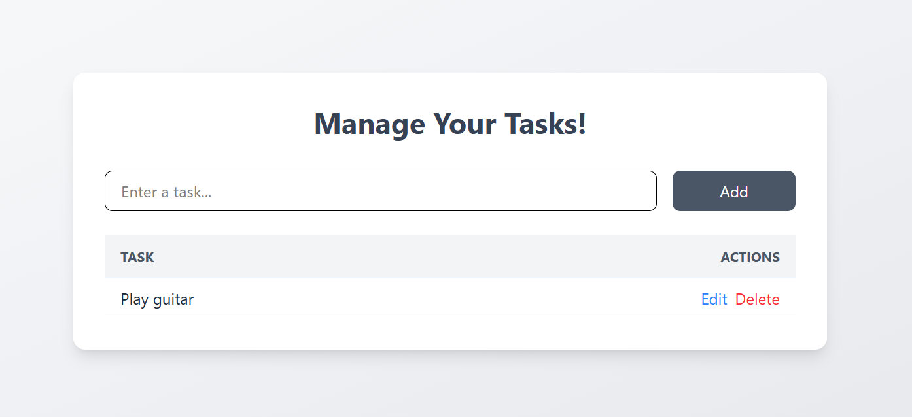

# Redux ToDo App

## Overview

This is a modern **ToDo application** built with **React**, **Redux Toolkit**, **Vite**, and **TailwindCSS**.  
The app is structured with **separate components** and uses a **global Redux store** to manage todos and their actions.

The UI is designed like a **professional task manager table**, with columns for **Task** and **Actions**.

---

### Pic

### Marked task complete

---

## Features

- Add new tasks
- Edit existing tasks
- Mark tasks as completed
- Delete tasks
- Fully managed with **Redux global state**
- Professional table layout design
- Responsive and modern UI with **TailwindCSS**
- Interactive hover effects and smooth transitions

---

## Table Layout

| Task Actions                                       |
| -------------------------------------------------- |
| Mark complete,Displays tasks, Edit / Save / Delete |

---

## Tech Stack

- **React** – for UI components
- **Redux Toolkit** – for state management
- **Vite** – fast React build tool
- **TailwindCSS** – modern utility-first CSS framework
- **JavaScript (ES6)**
